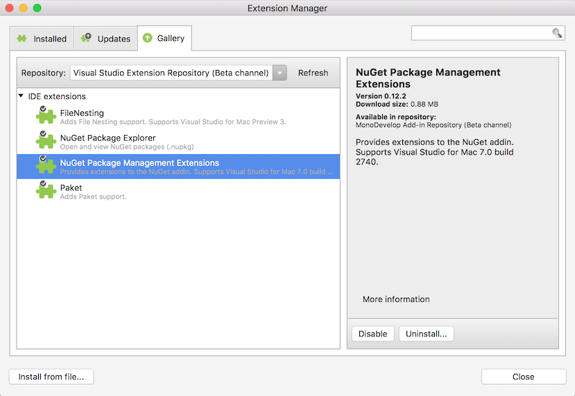
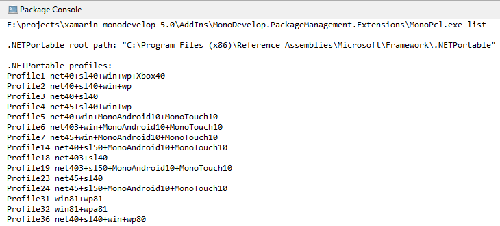
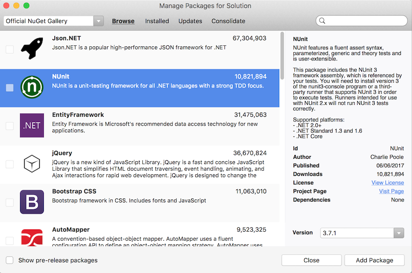

# Extends the NuGet Addin for MonoDevelop and Xamarin Studio

Adds some extra features to the NuGet addin that are not currently built-in.

These features are experimental, subject to change, removal, and should be considered alpha quality. 

# Features Overview

 * Installing a NuGet package from the unified search
 * Listing Portable Class Libraries available on the local machine
 * Installing, updating, uninstalling NuGet packages for multiple projects in one step.
 * PowerShell console window - powered by [Pash](https://github.com/Pash-Project/Pash).

# Requirements

 * MonoDevelop 5.0 or Xamarin Studio 5.0

# Installation

The addin is available from the [MonoDevelop addin repository](http://addins.monodevelop.com/). To install the addin:

 * Open the **Add-in Manager** dialog.
 * Select the **Gallery** tab.
 * Select **Xamarin Studio Add-in Repository (Alpha channel)** from  the drop down list.
 * Expand **IDE extensions**.
 * Select **NuGet Package Management Extensions**.
 * Click the **Refresh** button if the addin is not visible.
 * Click **Install...** to install the addin.

Please make sure you close Xamarin Studio and then re-open it before opening the new Package Console window otherwise Xamarin Studio will crash.

# Features

In the following sections the features are covered in more detail.

## Install a NuGet package from the unified search

To install the latest version of a NuGet package

 * Make sure the project is selected in the **Solution** window.
 * Type the package id into the unified search.
 * Select **Add Package** from the list in the pop-up window.

The NuGet package will then be installed in the background.
 
To install a specific version of the package you can use the **-version** option:

       automapper -version 2.2.1
       

 
The status bar will be updated as the install progresses. Errors will be displayed in the **Package Console**.

The unified search is available at the top right of the main Xamarin Studio window.

## Package search category

As a variation on how to add a package as described in the previous section, there is also a package search category which also allows you to add a package. Here the search category tag **nuget** or **package** must be typed in followed by the colon character. After the tag you can specify a package id and optionally the version number.

To add a package to a project

 * Make sure the project is selected in the **Solution** window.
 * Type the **package:** or **nuget:** followed by the package id into the unified search.
 * Select **Add Package** from the list in the pop-up window.

A specific package version can be installed by typing the version number after the package id.

## Listing Portable Class Libraries Installed

To see a list of the .NET Portable Class libraries available on the local machine, from the unified search select **List Portable Class Libraries**.

This runs the [Mono Portable Class Library command line utility](https://github.com/mrward/mono-portable-class-library-util) which will look for portable class libraries installed on the local machine. The results are displayed  in the **Package Console**.

## Managing Packages for the Solution

The NuGet addin that is available for Xamarin Studio 4 included the ability to manage packages for the solution. You could install, update or uninstall packages for multiple projects in one step. This feature is has been made available for Xamarin Studio 5 by the extension addin.

To open the Manage Packages dialog:

 * Make sure the solution is selected in the **Solution** window.
 * Right click the solution and select **Manage Packages**.
 * Or select **Manage Packages** from the **Project** menu.

### Install a package into multiple projects

 * Select the package in the **Available** tab.
 * Click the **Manage** button.

Then a Select Projects dialog will be displayed.

Tick the projects you want to install the package and click **OK**.

### Uninstalling a package from multiple projects

To uninstall a package from multiple projects:

 * Open the **Manage Packages** dialog.
 * Select the **Installed** tab.
 * Select the package you want to uninstall.
 * Click the **Manage** button.
 * Untick the projects you want the package to be uninstalled from.
 * Click **OK**.

## PowerShell Console Window

Please make sure you have closed and re-opened Xamarin Studio after the addin has been installed before trying to open the PowerShell Console window otherwise Xamarin Studio will crash.

To open the console window, from the **View** menu select **Pads**, then select **Package Console Extension**.

From the top of the Package Console Extension window you can choose a package source or a project. You can also clear the text from the Package Console by clicking the Clear Console button.

From the console itself you can run the standard NuGet commands:

 * Install-Package
 * Uninstall-Package
 * Update-Package
 * Get-Package
 * Get-Project

The console uses [Pash](https://github.com/Pash-Project/Pash) which is an open source reimplementation of Windows PowerShell, for Mono.

When you install, uninstall or update a NuGet package the console will run the **init.ps1**, **install.ps1** and **uninstall.ps1** scripts that the NuGet package contains. However there are some areas of PowerShell that Pash has not fully implemented so most PowerShell scripts will fail. The failure will be logged in the console window but will not prevent the package from being installed or uninstalled.
